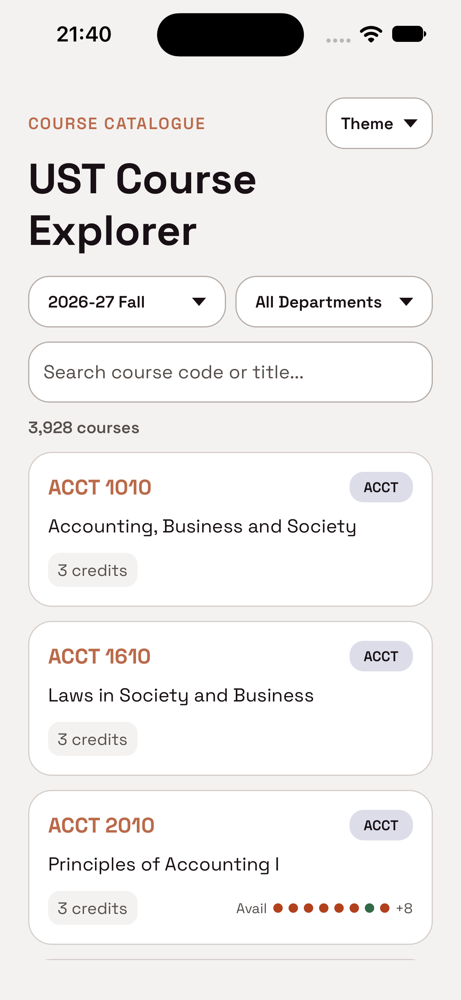
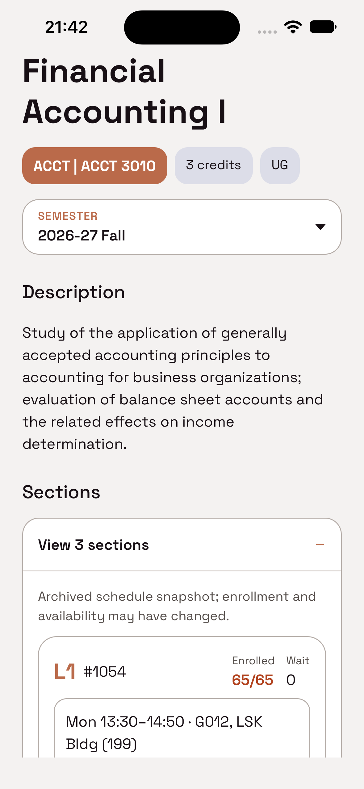
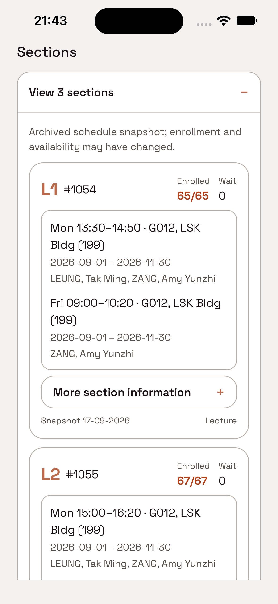
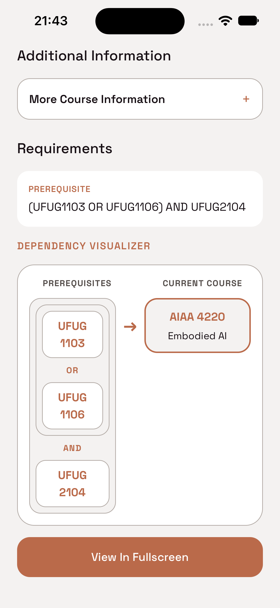

# UST Course Explorer

An offline-first HKUST course catalogue built with React Native and Expo.
Browse four supplied semesters: search and filter thousands of courses, compare a course across semesters, explore prerequisite relationships, and inspect archived class sections without a backend or live university API.

---

#### Content

1. Highlights
2. Setup
3. Features
4. Verification
5. Preprocessing, validation, and regeneration
6. Assumptions, limitations, and optional features
7. Architecture
8. Acknowledgements

---

## 1. Highlights

| Catalogue                               | Course Details                                   | Sections                              | Dependency Explorer                                |
| --------------------------------------- | ------------------------------------------------ | ------------------------------------- | -------------------------------------------------- |
|  |  |  |  |

- Fast local catalogue for 15,178 supplied course records across four semesters.
- Immediate code/title search with department filters
- Section availability preview
- Semester-aware Course Details that preserves the original prerequisite, corequisite, and exclusion text.
- Dependency visualizer powered by safe prerequisite parser, available in compact graph plus a deeper landscape fullscreen explorer.
- Explicit handling for uncertain natural language, repeated courses and cycles.
- Archived Sections and lecture-seat indicators from a pinned schedule snapshot; these are not live registration data.
- System, Light, and Dark themes with persisted preference.

---

## 2. Setup

#### Requirements

- macOS with Xcode and an iOS Simulator runtime installed.
- Node.js 20 or newer.
- Corepack, which is included with supported Node.js installations.

Confirm the local toolchain before installing the project:

```bash
node --version
corepack --version
xcode-select -p
xcodebuild -version
```

#### Install from a fresh clone

```bash
git clone https://github.com/spiritdolphin/AppTechTest.git
cd AppTechTest
corepack yarn install --frozen-lockfile
```

The project declares Yarn 1.22.22 in `package.json`.

#### Run in an iOS Simulator

List the simulator devices and runtimes installed on the Mac:

```bash
xcrun simctl list devices available
```

Open Simulator, then select the required model and runtime.

```bash
open -a Simulator
corepack yarn ios --device
```

On the first run, Expo generates the `ios/` native project, installs CocoaPods,
builds the development client with Xcode, installs it in the selected simulator, starts
Metro, and opens the app. A successful first launch includes output similar to:

```text
Build Succeeded
Installing on iPhone 14 Pro
Opening on iPhone 14 Pro (com.usthing.apptechtest27)
iOS Bundled ... index.tsx
```

Keep the terminal process running while using the development client. Press `Ctrl+C` to
stop Metro. Later launches to start Metro without rebuilding the installed development client:

```bash
corepack yarn start
```

Then press `i` in the Expo terminal to open the booted iOS Simulator.

---

## 3. Features

#### Search and filters

Search normalizes both the query and generated fields with Unicode NFKC normalization, lowercase conversion, and removal of spaces/hyphens.
For example, `COMP1021`, `comp-1021`, and `COMP 1021` are equivalent.

Catalogue cards may show an `Avail` row with up to eight green/red dots and a `+N` remainder for qualifying lecture sections. A missing or failed optional summary simply omits the row; search and navigation remain usable.

#### Course Details and semester switching

Course Details receives a typed `courseCode` and `termCode`. It loads the selected detail and independently checks every supplied semester for that course.

The screen shows title, credits, description, and every other non-empty catalogue field. Empty strings and arrays are omitted. Prerequisite, corequisite, and exclusion are rendered from their untouched source strings.

When archived schedule rows match the selected term and course ID, a collapsed Sections panel appears.

#### Prerequisite parsing

The parser deliberately supports a small grammar:

```text
course code
course code AND course code
course code OR course code
parenthesized combinations
safe repeated-prefix shorthand, e.g. UFUG 1103 OR 1106
```

Spaced, compact, and hyphenated codes are normalized. `AND` binds more tightly than `OR`.
Operator matching is case-insensitive. The app does not distinguish a boolean `OR` from natural-language `or` by capitalization. It accepts a structured expression only when there is no meaningful unknown text, a valid expression tree exists, and every recognized token is consumed:

```ts
complete = !unknownText && Boolean(expression) && consumed === tokens.length
```

If that safety gate fails, the partial tree is discarded. The UI shows a clearly labelled `Extracted courses` fallback, while retaining the complete original text. Known false-positive prefixes such as `ABOVE`, `FROM`, `TO`, and `OR` are rejected; the reviewed historical `CORE` prefix is allowed.

#### Dependency traversal

The graph resolves prerequisites only inside the selected semester. Corequisites and exclusions are not graph edges. Course nodes can be clicked to navigate to the respective course details, allowing recursive exploration.

- a prerequisite pointing to an ancestor is marked `Cycle`;
- a course already expanded through another branch is marked `Repeated`; and
- a node beyond the automatic depth limit is marked `More`

The portrait Course Details graph expands one level for fast preview.
The landscape fullscreen graph expands two levels with course titles, SVG connectors, and arrowheads. Selecting `More` focuses that course in the same fullscreen route, allowing recursive exploration.

---

## 4. Verification

```bash
corepack yarn compile
corepack yarn lint:check
corepack yarn test --runInBand
corepack yarn data:check
corepack yarn depcruise
```

Fresh-clone verification was completed for repository `main` at `7a91086` on 2026-09-28:
dependency installation, TypeScript, ESLint, Jest, data validation, an iOS native build, and a
visual launch on an iPhone 14 Pro simulator all passed.

Tests cover course and schedule preprocessing/integrity, repository caching and validation, search/filter rules, parser safety, dependency resolution, cycle/repetition handling, connector geometry, Sections loading and rendering, lecture-summary behavior, screen states, navigation, orientation races, i18n, and storage.

#### Platforms tested

Tested in Xcode26.6 Simulator on Macbook (Apple Silicon)

- iPhone 14 Pro simulator, iOS 27.0.
- iPhone 17 Pro Max simulator, iOS 26.5.
- iPad Pro 13-inch (M5) simulator, iOS 26.5.

Android and web are available through Expo scripts but have not been verified to the same level as iOS.

#### Performance decisions

- The 28.9 MB source file is not parsed at runtime.
- Graph depth is bounded and exploration changes focus instead of drawing an unlimited canvas.

---

## 5. Preprocessing, validation, and regeneration

The supplied starter data is course-catalogue data: `courses.json` contains catalogue records, not class Sections or live seat availability.

#### Dataset inclusion and placement

The supplied `courses.json` is included and tracked at the repository root. The derived `generated/courses/` files are also committed, so a normal fresh clone can install and run without moving the dataset or regenerating it.

If the catalogue dataset is distributed separately, place it at exactly:

```text
<repository-root>/courses.json
```

Then run `corepack yarn data:build` followed by `corepack yarn data:check` before launching the app. Do not place it under `app/`, `assets/`, or `generated/`; the preprocessing script reads the root path, while runtime code reads only the generated shards.

Sections are an implemented optional bonus sourced separately from UST Archive's pinned
[`classes.parquet`](https://huggingface.co/datasets/ust-archive/schedule/blob/5ee0630dbac7071851fc70c1692f80bea92ade7e/classes.parquet) schedule snapshot. The raw Parquet file is not committed; the generated Sections shards are committed so a fresh clone still works offline.

The optional Parquet source does not need a fixed repository location: `sections:build` downloads the pinned revision by default, or accepts an explicit local path as shown below.

```text
courses.json
  → corepack yarn data:build
  → generated/courses/
      ├── manifest.json
      ├── semesters.json
      ├── catalogues/{term}.json
      ├── details/{term}.json
      └── prerequisites/{term}.json

pinned classes.parquet + catalogue term/course IDs
  → corepack yarn sections:build
  → generated/sections/
      ├── manifest.json
      ├── {term}.json
      └── availability/{term}.json
```

Catalogue shards contain only card/search fields.
Detail shards retain the full catalogue fields.
Prerequisite shards contain original text, extracted course references, and forward/reverse indexes.

The Sections build joins archived schedule rows to courses by term code and course ID, retains each section's latest snapshot only when active, and produces full section shards plus small lecture-availability summaries. Separate manifests record schema/source versions, fingerprints, checksums, and counts.

The repository uses static loader maps so Metro can bundle known JSON files. Shards are evaluated lazily and cached as Promises; static inclusion does not reduce the app bundle's composition. Schema version and term code are validated on every first load; failed Promises are removed so Retry can perform a fresh load.

Use the following commands to reproduce, validate, or intentionally regenerate the committed data:

```bash
# Rebuild course catalogue, detail, and prerequisite shards from courses.json.
corepack yarn data:build

# Rebuild Sections and lecture-availability shards from the pinned remote snapshot.
corepack yarn sections:build

# Alternatively, use a local copy that matches the pinned checksum.
corepack yarn sections:build /path/to/classes.parquet

# Rebuild only compact lecture availability from committed Sections shards.
corepack yarn availability:build

# Validate all generated course and Sections files without network access.
corepack yarn data:check
```

When `courses.json` intentionally changes, commit it with the regenerated course shards. Do not directly edit generated files manually. A different schedule revision requires an intentional pin and checksum update plus a review of the join statistics.

The Sections build joins `term_code + course_id` to the supplied catalogue's `term_code + id`,
retains the latest active snapshot for each section, and reports unmatched active rows. It does not guess matches from titles or course codes.

---

## 6. Assumptions, limitations, and optional features

#### Key assumptions and scope decisions

- The app is an offline, read-only explorer. Required features do not depend on a backend,
  authentication, or a live university API.
- Term codes and course IDs in the supplied catalogue are treated as stable identifiers. Sections are joined only by exact term and course ID; ambiguous records are not guessed.
- The Dependency Explorer is deliberately **prerequisite-only**. Prerequisites have a directional
  dependency that fits recursive traversal, while corequisites and exclusions remain visible in Course Details but are not graph edges.
- Dependency resolution stays within the selected semester. A referenced course that is not
  offered in that semester remains visible but disabled.

#### Limitations

- The prerequisite parser handles a conservative grammar, not arbitrary natural language. When a full parse is unsafe, it preserves the original text and shows only conservatively extracted course references.
- Automatic graph expansion is depth-bounded. Deeper exploration continues by focusing a `More` node instead of rendering an unlimited graph or navigation stack.
- The app contains four supplied semesters; it does not fetch new catalogue terms at runtime.
- Section enrollment, waitlist, and open status are historical snapshots, not current registration
  availability or seat guarantees.
- iOS has received the primary simulator verification. Android and web scripts exist but have not been verified to the same level.

#### Optional features implemented

- Archived Sections and compact lecture-availability indicators, sourced from the separate pinned schedule snapshot. Missing schedule data degrades without blocking catalogue browsing or course details.
- A landscape fullscreen prerequisite graph with recursive focus, cycle/repetition handling, and
  navigation to prerequisite courses.
- Persisted System, Light, and Dark appearance preferences through MMKV.

---

## 7. Architecture

The app is an offline, read-only client with no backend or live API. Its runtime architecture
separates presentation, application state, domain logic, and generated data access:

#### Architecture diagram

```text
React Native screens and components
        │ user actions / route parameters
        ▼
Screen-local state and feature hooks
        │ typed repository calls
        ▼
CourseRepository ─────────────► in-memory Promise caches
        │ static loader maps
        ▼
generated/courses + generated/sections JSON shards
        ▲
        │ build time only
preprocessing scripts ◄──────── supplied catalogue + pinned schedule snapshot
```

The UI never imports the large source datasets or performs preprocessing. Screens request only
the semester-specific catalogue, details, prerequisites, Sections, or lecture-availability shard
they need.

#### Module boundaries

The app uses feature-based modules, with the course feature owning its UI, domain rules, and data
access instead of spreading them across global folders:

```text
app/
├── features/courses/
│   ├── components/      cards, selectors, accordions, graph and Sections UI
│   ├── data/            local repository and dependency resolution
│   ├── domain/          types, filters, parser, graph model
│   ├── screens/         Catalogue, Details, fullscreen explorer
│   └── utils/           search, graph hook, connector geometry
├── navigators/          typed routes and orientation control
├── theme/               light/dark semantic tokens
├── i18n/                English translations
└── utils/storage/       MMKV wrapper
```

- `screens` coordinate loading, navigation, and view state. They do not parse source files or
  implement graph traversal directly.
- `components` are reusable presentation and interaction units such as course cards, selection
  sheets, Sections accordions, and graph rendering.
- `domain` contains data types and deterministic business rules, including catalogue filter state,
  prerequisite parsing, and dependency graph models.
- `data` provides the repository boundary and dependency resolver. Generated loader maps are kept
  separate so repository behavior can be tested with injected fixtures.
- `utils` contains feature-specific search, graph-loading hooks, and connector geometry. Shared
  application infrastructure remains outside the feature.

#### State management

The project deliberately does not use Redux, Zustand, or a server-state library. There is no shared
mutable backend state, and most interactions belong to one screen, so local React state is the
smallest sufficient model.

| State                                           | Owner                                 | Lifetime                                     |
| ----------------------------------------------- | ------------------------------------- | -------------------------------------------- |
| Search query, department, semester              | `CourseCatalogueScreen` reducer       | While the Catalogue route remains mounted    |
| Loaded shards, loading/error/retry state        | Each screen or feature hook           | Current screen instance                      |
| Selected detail semester and Sections expansion | Course Details and child components   | Current detail route                         |
| Fullscreen graph focus/history                  | Typed route parameters                | Fullscreen explorer route                    |
| Theme override                                  | Theme context backed by MMKV          | Across app launches                          |
| Navigation state                                | React Navigation; MMKV in development | According to the configured persistence mode |

Pushing Course Details leaves the Catalogue route mounted, so returning naturally preserves its
query, filters, and `FlatList` position without copying them into a global store. Changing semester
is handled by a small reducer and intentionally clears the search and department filter. The theme
is the only user preference persisted for normal app use; it follows the system unless a Light or
Dark override is stored.

#### Repository, loading, and failure boundaries

`CourseRepository` is the single runtime entry point for course data. It exposes typed operations
for catalogue, details, semester availability, Sections, lecture summaries, and dependency graphs.
Each generated shard is loaded through a known static loader so Metro can include it in the bundle,
then cached as a Promise by shard type and term code. Concurrent callers therefore share the same
load, and already-loaded data is reused without reparsing.

Every first load validates the shard schema version and term code. A rejected Promise is removed
from its cache, allowing a screen-level Retry action to make a fresh attempt. Required catalogue or
detail failures render an explicit error state; optional schedule availability fails independently
and simply omits its enhancement. A root error boundary remains as protection for unexpected render
failures, rather than replacing these recoverable feature-level states.

#### Navigation and orientation

React Navigation uses one typed native stack:

```text
CourseCatalogue
  → CourseDetails { courseCode, termCode, parentCourseCode? }
  → DependencyExplorerFullscreen { courseCode, termCode, graphHistory? }
```

Course codes and term codes travel in route parameters, so destinations can reload their own data
instead of depending on hidden global selection state. The fullscreen dependency explorer is a
full-screen modal. Selecting a truncated `More` node updates its focused course and appends to the
lightweight `graphHistory`; Back removes one focus step, while Close returns to Course Details. This
avoids growing an unbounded native navigation stack during deep exploration.

The orientation controller derives its lock from the active route: normal screens use portrait and
the fullscreen graph uses landscape. It versions asynchronous lock requests so a late completion
cannot leave the app in the wrong orientation after rapid navigation, and reapplies the current lock
when the app becomes active.

#### Architectural constraints

- Required features operate entirely from committed local data.
- Search and filtering are synchronous pure functions over the loaded catalogue shard.
- Preprocessing, checksums, joins, and prerequisite extraction remain build-time concerns.
- Sections and seat indicators describe a pinned historical snapshot, never live availability.
- Course and graph resolution stay within the selected semester; missing referenced courses remain visible but disabled.

---

## 8. Acknowledgements

- Template: Ignite React Native boilerplate.
- Course data is based on the provided technical-test dataset.
- UI inspiration: `ust-course-mobile` by frogbubbletea.
